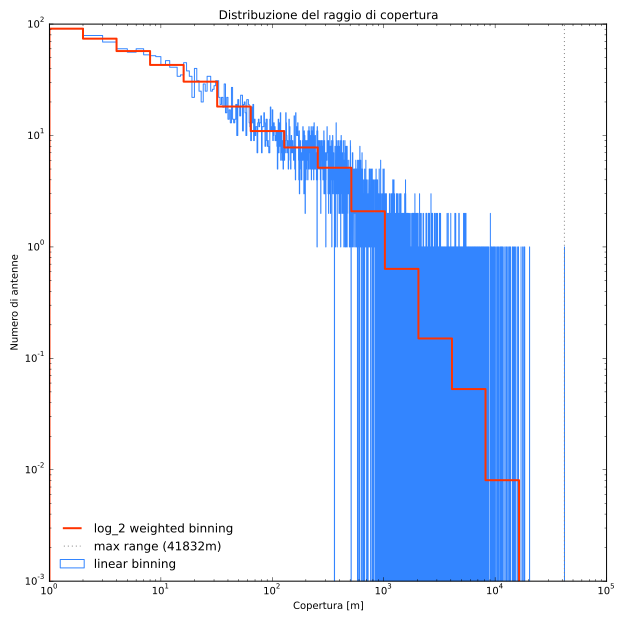
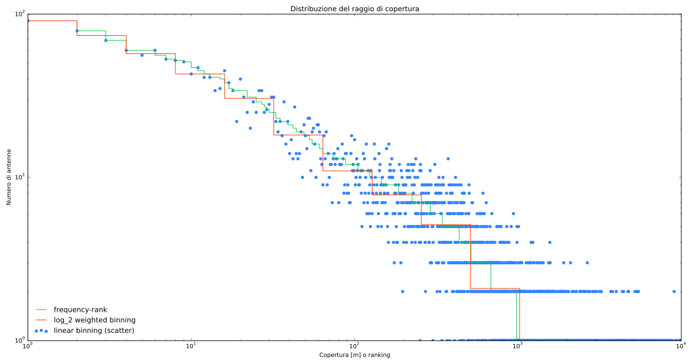

## Analisi del raggio di copertura delle antenne

Dato che ci servirà fare grafici con scale logaritmiche eliminiamo i dati di antenne che presentano un raggio nullo
```
range =! 0
```

Il raggio minimo risulta essere 1m, mentre quello massimo 20341m. Dato che il raggio del Grande Raccordo Anulare è circa 10km questo significa che ci saranno antenne con un grado di connessione totale.
TODO forse spostare questa considerazione a quando si è spiegato il criterio di linking.
TODO spiegare la possibile casa di questi valori di raggi così bassi

Facciamo un istogramma log-log per la distribusione del raggio di copertura, sia con la canalizzazione lineare sugli interi, sia con una canalizzazione logaritmica in base 2, per ridurre il rumore sulla coda.

La canalizzazione logaritmica pesata permette di osservare l'andamento ben sotto il singolo conteggio, ampliando di una decade l'intervallo di osservazione.

In figura si può vedere come l'andamento sia abbastanza power-law su diverse decadi, soprattutto fino a `conteggio = 1`. Per verificare ulteriormente questo fatto abbiamo generato anche la curva del frequency-rank, che risulta seguire senza esitazioni il trend delineato dagli istogrammi.
TODO  cercare di spiegare questa power-law.
Il frequency-rank si ottiene ordinando in maniera decrescente il numero di conteggi per ogni canale unitario e associando un relativo ranking intero decrescente ai raggi corrispondenti.


Si è infine analizzata la distribuzione cumulata, lasciata nel grafico seguente non normalizzata.
La distribuzione cumulata $C(x)$ rappresenta la probabilità che la variabile random assuma un valore minore o uguale a $x$.

TODO capire l'andamento della cumulata

TODO mettere caption nell'html delle figure

TODO Facendo un fit TODO abbiamo ottenuto il seguerte esponente per l'andamento a potenza: TODO
TODO mettere retta con pendenza con fit a mano spannometrico

